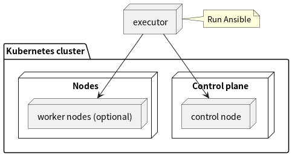

# setup kube-cluster

This repository is for setting up a kubernetes cluster for development on cloud instances (AWS EC2) by `Ansible`. It is useful to build a cluster in the following environments.

- Cluster on EC2 instances instead of cloud-managed service (EKS).
- Baremetal cluster on your local environment such as raspberry pi.


A node that runs Ansible (referred to as executor here) creates kubernetes cluster using kubeadm. The cluster consists of the following nodes.

- One control node including control plane components
- Multiple worker nodes (optional)




# Requirements
An executor requires ansible module.

- ansible >= 2.10.0
- ansible-playbook >= 2.10.0

The executor also requires [kubernetes module](https://docs.ansible.com/ansible/latest/collections/kubernetes/core/k8s_module.html) to deploy manifests to cluster using ansible module. Install the kubernetes collection using `ansible-galaxy`.

```

ansible-galaxy collection install kubernetes.core
```


The control node and workers need to meet [kubernetes hardware requirements](https://kubernetes.io/docs/setup/production-environment/tools/kubeadm/install-kubeadm/#before-you-begin) and to install python3.


# Quickstart
Clone the repository.

```
git clone https://github.com/git-ogawa/setup_kube_cluster
cd setup_kube_cluster
```

Edit public IPv4 address, username, port and ssh key of your node under `master1` section in `inventory`.

```yml
# inventory
all:
  ...
  children:
    control_plane:
      hosts:
        master1:
          ansible_host: 10.10.10.10  # Public IPv4 address
          ansible_user: ubuntu  # Username
          ansible_ssh_port: 22  # SSH port
          ansible_ssh_private_key_file: ~/.ssh/id_rsa  # Path to ssh key
```

To add worker nodes to cluster, set values for hosts as worker more in the same way under `worker`. The following are the example to add two host `myworker1, 2` to the cluster as worker nodes.

``` yaml
all:
  ...
  children:
    worker:
      hosts:
        myworker1:
          ansible_host: 10.10.10.11
          ansible_user: ubuntu
          ansible_ssh_private_key_file: ~/.ssh/id_rsa
        myworker2:
          ansible_host: 10.10.10.12
          ansible_user: rocky
          ansible_ssh_private_key_file: ~/.ssh/id_rsa
```


The `calico` is used for CNI by default. When you want to use other CNI, set the CNI name to `cni_type` and cidr `network_cidr`. The supported cni are the followings.

- calico
- flannel


``` yaml
all:
  vars:
    cni_type: calico
    network_cidr: "10.244.0.0/16"
```


To create a new cluster, run the following command to create the cluster.

```
$ ansible-playbook setup.yml
```

The setup playbook installs the necessary CLI, creates the cluster, and deploys the following components. You can manage whether each component is installed during the installation process by editing the inventory file. See [setup_cluster.md](docs/setup_cluster.md) for details.


| Component | Category | Installed by default |
| - | - | - |
| Nginx controller | Ingress controller | yes |
| OpenEBS | Storage | no |
| Longhorn | Storage | no |
| Kubevious | Dashboard | no |
| Octant | Dashboard | no |
| Tekton | CI/CD platform | no |
| Argocd | CD tool | no |
| Harbor | Image registry | no |
| Gitea | Git server | no |
| Kube-prometheus-stack | Monitoring | no |
| Openfaas | Serverless framework | no |
| Cert manager | Certificates management | no |
| Jaeger | Distributed tracing system | no |
| Linkerd | Service mesh | no |
| Velero | Backup and restore management | no |

# HA cluster

The project can create HA (High Availability) cluster consisting of stacked control plane nodes with kubeadm. The machines that meet the following requirements are required to create the HA cluster.

- Two or more machine that meet requirements (see [Creating Highly Available Clusters with kubeadm](https://kubernetes.io/docs/setup/production-environment/tools/kubeadm/high-availability/#before-you-begin) ) are required as control plane nodes.
- One or more load balancer that routing to nodes on control plane.


To create HA cluster, set `ha_cluster.enabled: true` in `inventory`.

``` yml
all:
  vars:
    ...
    ha_cluster:
      enabled: true
```

Set host definitions used as nodes on control plane, worker nodes and load balancer.

- Set name of hosts (e.g. kube-master1 below) to match the hostname on the machine.
- When the ip address used for communication between nodes is different from the one used by the machine running the playbook for ssh (such as public ip or floating ip), set the former value `internal_ipv4`. Otherwise, set the same value for `ansible_host` and `internal_ipv4`.


```yml
# inventory
all:
  ...
  children:
    cluster:
      children:
        control_plane:
        worker:
    control_plane:
      # Define Two or more hosts to be used as control plane.
      hosts:
        kube-master1:
          ansible_host: 10.10.10.11
          ansible_user: ubuntu
          ansible_ssh_private_key_file: ~/.ssh/id_rsa
          internal_ipv4: 192.168.3.11
        kube-master2:
          ansible_host: 10.10.10.12
          ansible_user: ubuntu
          ansible_ssh_private_key_file: ~/.ssh/id_rsa
          internal_ipv4: 192.168.3.12
        kube-master3:
          ansible_host: 10.10.10.13
          ansible_user: ubuntu
          ansible_ssh_private_key_file: ~/.ssh/id_rsa
          internal_ipv4: 192.168.3.13
    worker:
      # Define zero or more hosts to be used as worker node.
      hosts:
        kube-worker1:
          ansible_host: 10.10.10.14
          ansible_user: ubuntu
          ansible_ssh_private_key_file: ~/.ssh/id_rsa
          internal_ipv4: 192.168.3.14
    load_balancer:
      # Define One or more hosts to be used as load balancer.
      hosts:
        load-balancer1:
          ansible_host: 10.10.10.20
          ansible_user: ubuntu
          ansible_ssh_private_key_file: ~/.ssh/id_rsa
          internal_ipv4: 192.168.3.20
```

Then run `setup.yml`.

```
$ ansible-playbook setup.yml
```

If successfully finished, multiple control plane nodes are created as shown below.

```
$ kubectl get node
NAME           STATUS   ROLES           AGE   VERSION
kube-master1   Ready    control-plane   93m   v1.26.0
kube-master2   Ready    control-plane   83m   v1.26.0
kube-master3   Ready    control-plane   81m   v1.26.0
kube-worker1   Ready    <none>          41m   v1.26.0
```


# Details
See [setup_cluster.md](docs/setup_cluster.md)


# Support distributions
The following distribution (platform) instances are supported.

- RHEL-based distribution (such as rocky linux)
- Ubuntu 22.04
- Amazon linux
  - Supported only to install CLI commands such as kubectl
